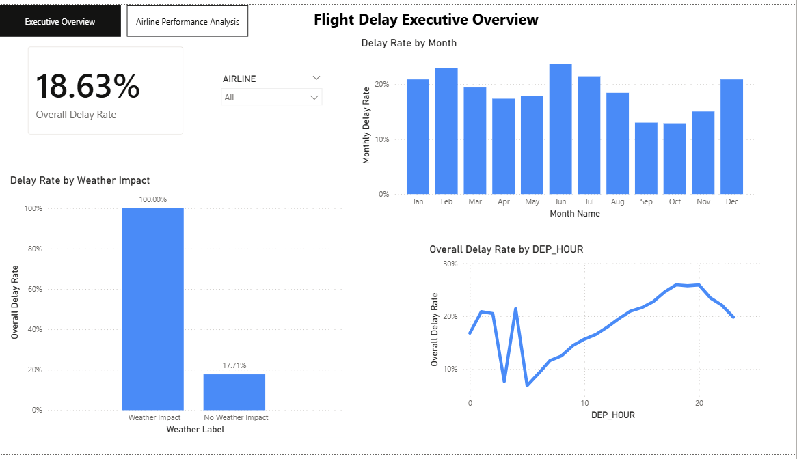

# flight-delay-prediction
End-to-End Flight Delay Prediction and Analysis using Python and Power BI

# Flight Delay Prediction System (Python + Power BI)

## Overview
This project predicts whether a flight will be delayed (Arrival Delay ≥ 15 minutes) using historical U.S. flight data.  
It includes end-to-end data analytics: data cleaning, time-based exploratory analysis, feature engineering, classification modeling, and dashboard reporting.

## Problem Statement
Airlines and airports need early indicators of delays to support staffing, scheduling, and passenger communication.  
**Goal:** Predict flight delay (Delayed vs Not Delayed) and identify key drivers (time, season, airline, weather impact).

## Dataset
- Main file used: `flights.csv` (sample used in GitHub for reference)
- A representative **5K sample** is included in this repo under `/data`.

## Workflow
### 1) Data Cleaning
- Removed cancelled/diverted flights
- Handled missing values for delay fields
- Created target column:
  - `DELAYED = 1` if `ARRIVAL_DELAY >= 15`, else `0`

### 2) Time-Based EDA
- Delay rate by **Month**
- Delay rate by **Day of Week**
- Delay rate by **Departure Hour**
Key insight: delays increase later in the day (peak around 16:00–20:00).

### 3) Feature Engineering
- `DEP_HOUR` from scheduled departure time
- `SEASON` from month
- `IS_WEEKEND`
- `IS_PEAK_DELAY_HOUR` (16–20)
- `WEATHER_IMPACT` from `WEATHER_DELAY`

### 4) Modeling (Classification)
- Model: **Logistic Regression**
- Handled class imbalance using `class_weight="balanced"`
- Evaluation: Accuracy, Confusion Matrix, Classification Report  
Balanced model improved delayed-flight recall, making it more useful for operational risk detection.

### 5) Key Delay Drivers
Logistic Regression coefficients show **WEATHER_IMPACT** as the strongest predictor of delays, followed by seasonal and airline effects.

## Power BI Dashboard
Two-page interactive dashboard:
1. **Executive Overview** – overall delay rate, monthly trend, hourly trend, weather impact, airline slicer
2. **Airline Performance Analysis** – top airlines by delay rate + airline × season heatmap

### Dashboard Preview
**Executive Overview**

**Airline Performance Analysis**

## Repository Structure
- `/notebooks` → Jupyter notebook (analysis + modeling)
- `/dashboard` → Power BI `.pbix` + screenshots
- `/report` → final PDF report
- `/data` → 5K sample dataset

## How to Run
1. Open the notebook in `/notebooks` and run cells in order (recommended: Jupyter).
2. Open `/dashboard/*.pbix` in Power BI Desktop to view interactive dashboard.

## Tech Stack
Python (Pandas, NumPy, Matplotlib), scikit-learn, Power BI

## Results Summary
- Overall delay rate ≈ **18–19%**
- Weather impact is the strongest operational risk factor
- Delays peak in the evening hours due to congestion and delay propagation
